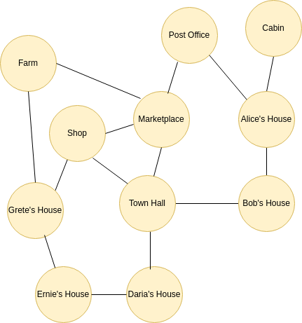

# eloquent js

## 7. Проект Робот

Разбор оригинальной задачи ["Проект Робот"](https://eloquentjavascript.net/07_robot.html):

Есть деревня Луговое с 11 домами, между которыми проложено 14 троп:


Роботу почтальону необходимо используя имеющиеся тропы доставить все посылки адресатам, попутно забирая их в посещаемых домах.

### Данные

Дано 3 массива:

1. `roads` - тропы
2. `parcels` - посылки
3. `mailRoute` - маршрут обхода деревни

#### Тропы

14 тропинок описаны в массиве `roads` в формате *Начало маршрута*-*Конец Маршрута*:

```js
const roads = [
  "Alice's House-Bob's House",   "Alice's House-Cabin",
  "Alice's House-Post Office",   "Bob's House-Town Hall",
  "Daria's House-Ernie's House", "Daria's House-Town Hall",
  "Ernie's House-Grete's House", "Grete's House-Farm",
  "Grete's House-Shop",          "Marketplace-Farm",
  "Marketplace-Post Office",     "Marketplace-Shop",
  "Marketplace-Town Hall",       "Shop-Town Hall"
];
```

Данный массив не очень удобен для поиска всех домов, которые имеют тропы с почтой и т.д. удобнее использовать другую структуру данных.

##### Граф

На основе массива троп всю деревню можно представить в виде графа:



где, деревня это граф, дома - вершины, а тропинки - ребра.

Необходимо массив `roads` преобразовать в граф `roadGraph`, используя функцию `buildGraph`:

```js
function buildGraph(edges) { // построитьГраф(маршруты)
  let graph = Object.create(null); // объект граф = чистый объект
  function addEdge(from, to) { // функция добавитьТочку(из, в)
    if (from in graph) { // если из уже в графе
      graph[from].push(to); // то добавить в массив поля со значение "из" объекта граф элемент со значением "в"
    } else { // иначе
      graph[from] = [to]; // создать массив с одним элементом со значением "в"  в поле объекта со значением "из" 
    }
  }
  for (let [from, to] of edges.map(r => r.split("-"))) { // пробежаться по картежу (из, в) разделенных по "-" в объекте маршруты   
    addEdge(from, to); // добавить с помощью функции построитьГраф точки из-в
    addEdge(to, from); // добавить с помощью функции построитьГраф точки в-из
  }
  return graph;
}
```

Функция вернет объект в виде структуры графа:

```js
const roadGraph = {
  "Alice's House": [ "Bob's House", 'Cabin', 'Post Office' ],
  "Bob's House": [ "Alice's House", 'Town Hall' ],
  Cabin: [ "Alice's House" ],
  'Post Office': [ "Alice's House", 'Marketplace' ],
  'Town Hall': [ "Bob's House", "Daria's House", 'Marketplace', 'Shop' ],
  "Daria's House": [ "Ernie's House", 'Town Hall' ],
  "Ernie's House": [ "Daria's House", "Grete's House" ],
  "Grete's House": [ "Ernie's House", 'Farm', 'Shop' ],
  Farm: [ "Grete's House", 'Marketplace' ],
  Shop: [ "Grete's House", 'Marketplace', 'Town Hall' ],
  Marketplace: [ 'Farm', 'Post Office', 'Shop', 'Town Hall' ]
}
```

где, для каждой вершины указаны ее смежные.

#### Посылки

Массив посылок `parcels` имеет структуру:

```js
const parcels = {
    {place: "Daria's House", address: "Post Office"},
    {place: "Alice's House", address: "Bob's House"},
}
```

где, для каждой посылки указано ее место положение и назначения.

Массив посылок можно задать самому, либо случайным образом, с помощью кода:

```js
let parcels = []; // пустой массив посылок
for (let i = 0; i < parcelCount; i++) { // генерим нужное количество посылок в соответствии с переданным параметром parcelCount
// Вынимаем рандомно адресата из объекта графа roadGraph
let address = Object.keys(roadGraph)[Math.floor(Math.random() * Object.keys(roadGraph).length)];
let place; 
do { // вынимаем рандомно место нахождения посылки из объекта графа
    place = Object.keys(roadGraph)[Math.floor(Math.random() * Object.keys(roadGraph).length)];
} while (place == address); // есть место посылки и адресат совпадают, то повторяем цикл
parcels.push({place, address}); // если место и адресат разные, то добавляем посылку в массив
```

#### Маршрут

Не во все дома можно добраться напрямую. Обойти все места в деревне можно несколькими маршрутами, один из которых представлен в оригиналом проекте:

```js
const mailRoute = [
  "Alice's House", "Cabin", "Alice's House", "Bob's House",
  "Town Hall", "Daria's House", "Ernie's House",
  "Grete's House", "Shop", "Grete's House", "Farm",
  "Marketplace", "Post Office"
]
```

Данный маршрут используется только одним роботом, который имеет память. Остальные будут искать маршруты сами.

### Действия

В процессе обхода графа нужно выполнять следующие действия:

1. Фиксация состояний
    - посылок
    - робота
2. Обработка посылок
    - загрузка
    - выгрузка

#### Фиксация состояний

Для хранения состояний робота и посылок будем использовать объекты класса `VillageState` в конкретный момент времени, как кадры анимации или кинопленки.
Конструктор класса состояния принимает два аргумента: текущее положение робота и массив недоставленных посылок.

```js
class VillageState {
  constructor(place, parcels) { // конструктор принимает (положение робота, коллекцию посылок)
    this.place = place; // положение робота
    this.parcels = parcels; // коллекция недоставленных посылок
  }
  random(parcelCount = 5) {
  // код метода в разделе «Посылки»
  return new VillageState("Post Office", parcels);
 }
  move(destination) { // метод перемещения принимает положение робота
    // код метода в разделе «Обработка посылок»
      return new VillageState(destination, parcels); // возвращаем новое состояние деревни, где положение робота меняется на назначение
// из прошлого состояние и измененную коллекцию посылок
    }
  }
}
```

#### Обработка посылок

Выполняется методом `move()` Если нам известно место робота `this.place` и место назначения `destination`, то можно принять решение о каждой посылке:

```js
if (!roadGraph[this.place].includes(destination)) { // если текущее положение робота не имеет точки назначения, то
    return this; // вернуть текущее состояние деревни целиком
} else {
    let parcels = this.parcels.map(p => { // новый массив посылок, который мы вернем в новое состояние деревни, 
            // размапим текущий массив посылок, где рассматриваемая посылка это p
    if (p.place != this.place) return p; // если рассматриваемая посылка не равна текущему положению робота то вернем ее неизменной
    return {place: destination, address: p.address}; // иначе, мы меняем текущее место посылки на переданное в метод move(dest)
    }).filter(p => p.place != p.address); // удаляем доставленные посылки, т.е. оставляем только те, чье положение не равно назначению 
}
```

В классе `VillageState` коды выше помещен в метод `move()`.

Под капотом метод `move` выполняет сразу несколько действий:

1. Проверяет есть ли ребро от текущего положения робота к месту назначения в списке смежностей `roadGraph`.
    - если смежных вершин нет, то возвращает текущее состояние деревни.
    - если есть ребра, то:
        - пробегаемся по списку посылок:
            - если текущее место конкретной посылки не равно месту назначения, то возвращаем неизменную посылку.
            - иначе, меняем текущее местоположение конкретной посылки на место назначения аргумента move()
        - удаляем из списка посылок все чье текущее местоположение равно месту назначения, т.е. доставленные
        - создает новое состояние деревни с новым положением робота.
2. Возвращает новое состояние деревни, со следующими аргументами конструктора:
    - текущее положение робота - место назначения аргумента move()
    - список посылок - это измененный, т.е. отфильтрованный список посылок из прошлого состояния

Параметр `destination` передается в метод `move()` одним из 3-х роботов на выбор.

### Роботы

Роботом будем называть обычную функцию, которая принимает решение в какую сторону двигаться, она возвращает объект вида:

```js
{"direction": "Alice's House"}
```

т.е. направление в сторону дома Алисы.

Поиск направления движения можно осуществлять с помощью:

- Случайного выбора
- Заранее продуманного маршрута
- Различных алгоритмов: [BFS](https://en.wikipedia.org/wiki/Breadth-first_search) [DFS](https://en.wikipedia.org/wiki/Depth-first_search) [A*](https://en.wikipedia.org/wiki/A*_search_algorithm)

В соответствии с методами выбора направления следующего хода роботы могут быть:

1. Тупыми
2. С памятью
3. С умом

#### Тупой робот

Функция `randomRobot` - тупой робот без памяти, который рандомно выбирает маршрут и двигается пока не угадает все места назначения посылок.

```js
function randomRobot(state) {
  return {direction: randomPick(roadGraph[state.place])};
}
```

Функция randomPick(array) - возвращает случайное значение из переданного массива

```js
function randomPick(array) {
  let choice = Math.floor(Math.random() * array.length);
  return array[choice];
}
```

randomPick вынесена в вспомогательную функцию, чтобы реализовать принцип полиморфизма и показать, что данный код можно использовать повторно в других ситуациях.

#### Робот с памятью

routeRobot - Робот с памятью, который использует заранее переданный ему маршрут, описанный в разделе "Маршрут".

```js
function routeRobot(state, memory) {
  if (memory.length == 0) {
    memory = mailRoute;
  }
  return {direction: memory[0], memory: memory.slice(1)};
}
```

#### Робот с умом

goalOrientedRobot - Эффективный робот с памятью, который выбирает оптимальный маршрут

### Движок

Функции-роботы, возвращают только одно направление движения для конкретного состояния. Но, нужен механизм, автоматизирующий процесс запуска робота до полного опустошения массива посылок. Данным механизмом будет функция-движок `runRobot`:

```js
// функция принимает три аргумента: состояние, функцию-робот и память
function runRobot(state, robot, memory) {
  for (let turn = 0;; turn++) { // бесконечный цикл
    if (state.parcels.length == 0) { // если все посылки доставлены
      console.log(`Done in ${turn} turns`); // вывести количество ходов
      break; // выход
    }
    // присвоить возврат от функции-робота переменной action
    let action = robot(state, memory); // функция-робот принимает 2 аргумента: состояние и память
    state = state.move(action.direction); // сделать ход в направлении, которое вернула функция-робот
    memory = action.memory; // обновить локальную память функции движка значением, которое вернула функция-робот
    console.log(`Moved to ${action.direction}`); // вывести направление движения
  }
}
```

#### Запуск движка с тупым роботом

Движок может принимать сразу 3 аргумента, но не обязательно все, это фишка языка JS. Поэтому при запуске движка с тупым роботом укажем параметры состояние и функцию-робота:

```js
runRobot(villageState, randomRobot);
```

Все зависит от случайности, минимально зафиксированное мной количество ходов было 19, максимальное 173.

#### Запуск движка с роботом имеющим память

```js
runRobot(villageState, routeRobot, mailRoute);
```

#### Запуск движка с умным роботом